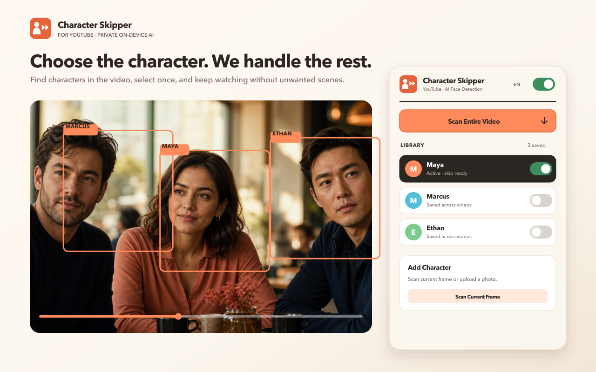

<div align="center">

# Character Skipper for YouTube

**Automatically skip scenes of the people you choose — with private, on-device AI face recognition.**

A Chrome extension by [Canquesse AI Solutions](https://github.com/canquesse).

[](https://github.com/canquesse/character-skipper/actions/workflows/ci.yml)


[Overview](https://canquesse.github.io/character-skipper/) · [Privacy](docs/privacy.html) · [Third-party licenses](THIRD-PARTY.md)

</div>

---



## What it does

Pick the people you don't want to see. While a YouTube video plays, the extension
analyzes frames **on your device**, recognizes those people, and skips past the
scenes where they appear.

- **Full-video scan** — sweeps the whole video and clusters every face it finds,
  so you can pick characters from a contact sheet instead of hunting for frames.
- **Cross-video memory** — saved characters are recognized in any other video.
- **Character profiles** — add faces from new scans to an existing character;
  the profile stays bounded and diverse instead of growing forever.
- **Fully local** — no servers, no analytics, no network requests. Models and
  fonts are bundled in the package.

## Privacy

Everything runs inside your browser. Video frames are analyzed in memory and are
never stored or transmitted. Saved face descriptors (numeric vectors) live only
in your browser's local extension storage.

Full policy: [`docs/privacy.html`](docs/privacy.html)

## How it works

```
BlazeFace (detection)
      ↓
FaceMesh (468 landmarks) → 5-point similarity alignment → 112×112 ArcFace crop
      ↓
w600k MobileFaceNet / ArcFace  (ONNX Runtime, WebAssembly)
      ↓
512-dim embedding → clustering & matching
```

Detection runs in a **Web Worker** hosted inside a hidden extension-origin
iframe. That indirection exists because a content script runs in the *page*
origin, where it can neither construct a worker from a `chrome-extension://`
URL nor use a `blob:` worker under YouTube's strict CSP.

Clustering thresholds are not hard-coded guesses: after a scan the extension
measures the distribution of inter-cluster distances in *that* video and cuts at
the identity gap. Per-character match thresholds are derived the same way, using
the unselected clusters as a measured imposter floor.

## Install (development)

```bash
git clone https://github.com/canquesse/character-skipper.git
cd character-skipper
./scripts/download-models.sh     # fetches the InsightFace weights (see below)
```

Then in Chrome: `chrome://extensions` → enable **Developer mode** → **Load
unpacked** → select this folder.

### Model weights

`models/w600k_mbf.onnx` is **not** mirrored in this repository. InsightFace
publishes its pretrained models for non-commercial research purposes only, so
you fetch it from upstream yourself with the script above.

Without it the extension still works — it automatically falls back to the
bundled MIT-licensed `faceres` model, at lower recognition accuracy.

## Build a store package

```bash
zip -r -X character-skipper-store.zip . \
  -x '.git/*' -x 'fotolar/*' -x 'docs/*' -x 'scripts/*' \
  -x 'chrome-web-store/*' -x '*.zip' -x '.DS_Store' -x '*/.DS_Store' \
  -x '.gitignore' -x 'README.md' -x 'THIRD-PARTY.md' -x 'LICENSE'
```

## Project map

| Area | Responsibility |
| --- | --- |
| `content.js` | YouTube playback integration and scan/skip controls |
| `detection-worker.js` | Frame analysis and face embeddings |
| `faceManager.js`, `storage.js` | Character profiles and local persistence |
| `popup.*` | Extension controls |
| `sandbox.*` | Extension-origin worker host |
| `docs/` | Public overview and privacy policy |

## Development checks

```sh
for file in *.js; do node --check "$file"; done
```

CI checks syntax and manifest file references. Recognition quality and playback behavior still need manual verification in Chrome: load the unpacked extension, scan a video, select a character, confirm skipping, and check that saved profiles survive a browser restart.

## Limitations

Recognition can be affected by lighting, camera angle, occlusion, small faces and similar-looking people. Scanning performance depends on the device and video. Review detected characters before enabling automatic skipping. Model licensing is separate from source licensing; the optional recognition weights have upstream restrictions.

## Contributing

See [CONTRIBUTING.md](CONTRIBUTING.md). Reproducible reports should include Chrome version, extension version and the scan/playback steps.

## Licenses

This extension's source code is MIT — see [`LICENSE`](LICENSE).
Bundled libraries, fonts and model weights carry their own terms — see
[`THIRD-PARTY.md`](THIRD-PARTY.md).
